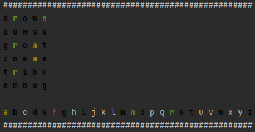

# gym-wordle

A gym environment for playing the game [Wordle](https://www.powerlanguage.co.uk/wordle/).

## About
Wordle is a word guessing game where the player has six guesses to guess the five letter hidden word of the day.

Based on the player's guess, the game provides feedback for each letter in the guessed word:
* If the letter is not in the hidden word at all, the letter is grayed out.
* If the letter is in the hidden word but not in the correct location, the letter is yellowed out.
* If the letter is in the correct location in the hidden word, the letter is greened out.

If the player guesses the word correctly before using up all six of their guesses, they win.

## Methodology
The following subsections describe the methodology used to create the environment.

### Words
All possible 5 letter candidate words for the game Wordle are "hidden" in the source code and can be extracted by inspecting the code via a browser like Firefox or Chrome.

I copied all possible words found in the source code to a text file, and encoded them such that they follow the following mapping:

```
a -> 0
b -> 1
...
z -> 25
```

This will corresponde nicely to stepping through the environment with agent actions, which will be explained further below.

An example of a possible Wordle word and the corresponding encoding that has been generated for the environment is below:

```
A P P L E -> 0 15 15 11 4
```

All of the encoded words are stored in `data/words_encoded.txt` as space seperated integers with one word per line.  Don't cheat!

### Environment

#### Observation Space
The Wordle game provides the player with 3 necessary pieces of information to play:

* Board: The `6 x 5` board shows the player for each guess which word was guessed and whether or not the characters in the guessed word are in the correct location.

* Alphabet: A keyboard is also shown to the player giving them a friendly perspective into what letters have been used in their guesses and whether or not they are found in the hidden word/in the correct location of the hidden word or not.

Therefore, the observation space in the environment is a `spaces.Dict` consisting of:

```
Dict(
    Board: spaces.Box(low=-1, high=2, shape=(6, 5), dtype=int)
    Alphabet: spaces.Box(low=-1, high=2, shape(26,), dtype=int)
)
```

By default, the value -1 is used in Board and Alphabet to denote an unused row in the board (i.e. when the player has only guessed two words, the last four rows will be filled with -1), and an unguessed letter in the alphabet (i.e. when a letter hasn't been used in a guessed word, it has a value of -1 in the alphabet observation space).

The observation space is updated each time step as the player guesses new words, and is populated with encodings in the following manner:

```
0: a guessed letter does not appear in the hidden word
1: a guessed letter does appear in the hidden word
2: a guessed letter is in the correct position in the hidden word
```

Sticking with the example encoding above (hidden word "APPLE"), assume the player's first guess is the word "OPENS". Below shows how the observation space would be updated:

```
board = [[ 0  2  1  0  0]
         [-1 -1 -1 -1 -1]
         [-1 -1 -1 -1 -1]
         [-1 -1 -1 -1 -1]
         [-1 -1 -1 -1 -1]
         [-1 -1 -1 -1 -1]]

alphabet = [[-1 -1 -1 -1 1 -1 -1 -1 -1 -1 -1 -1 -1 0 0 2 -1 -1 0 -1 -1 -1 -1 -1 -1 -1]]
```

Explained more in detail, the letter P in the second position is in the correct location, and the letter E in the third position is in the hidden word but in the wrong position. All other guessed letters in "OPENS" are not in "APPLE".

#### Action Space
In order to step through the environment, supply `env.step()` with a length 5 list of integers corresponding to the letter mapping explained above.

Using "OPENS" as the example again, simply execute:

```
obs, reward, done, _ = env.step([14, 16, 4, 15, 18])
```

#### Rewards and Exit Criteria

The reward structure for the game is below:
* If the player guesses the hidden word in six guesses or fewer, the environment returns `reward=1` and `done=True`.
* If the player hasn't guessed the hidden word but still has guesses remaining, the environment returns `reward=0` and `done=False`.
* If the player is out of guesses and hasn't guessed the hidden word, the environment returns `reward=-1` and `done=True`.

#### Render
The rendering is always a text output with colour-coded representation of correct letter usage, and letter placement.
It can be seen as follows:



## Installation

```
cd gym-wordle
pip install .
```

## Usage
You can initialize and use the `gym_wordle` OpenAI environment and make random guesses in the following manner:

```
import gym
import gym_wordle
from gym_wordle.exceptions import InvalidWordException

env = gym.make('Wordle-v0')

obs = env.reset()
done = False
while not done:
    while True:
        try:
            # make a random guess
            act = env.action_space.sample()

            # take a step
            obs, reward, done, _ = env.step(act)
            break
        except InvalidWordException:
            pass

    env.render()
```

## Future Improvements
At some point, I'd like to implement the following:
* Hard Mode: Wordle has a hard mode setting where once you reveal that a letter is in the hidden word, all subsequent guesses must contain the letter. The environment as it currently exists doens't have this functionality.
* Perhaps, a reward function that per step rewards for correct letter usage, and also correct letter placement.

## Updates
Version 0.0.2:
* Added requirement for using 5-letter English words.
* Changed file for words.
* Added a basic render that illustrates a colour-coded board, along with the alphabet.
* Fixed setup.py.

## Final Remarks
This repo was thrown together for fun in a matter of hours as a hands-on exercise in creating custom OpenAI Gym environments. I am by no means an export in Reinforcement Learning, Gym, or Python, and welcome all feedback/feature requests.
